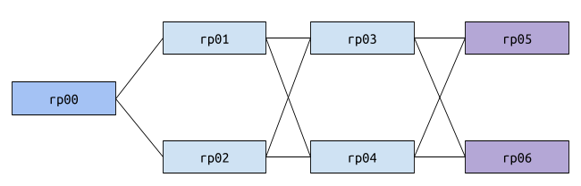

# Demo system design



- **rp00**: control node to send ansible-runner job
- **rp0[1234]**: routing node
- **rp0[56]**: worker node to receive and launch ansible-runner and ansible-playbook

# Building Receptor Demo Environment

1. git clone receptor-demo on each node
```
$ git clone https://github.com/saito-hideki/receptor-demo.git
```

2. specify your receptor node list as `RECEPTOR_NODES`
```
RECEPTOR_NODES="rp00 rp01 rp02 rp03 rp04 rp05 rp06"
```

3. generate ca and cert files under certs/ directory in first node(i.e. rp00)
```
$ ./bootstrap.sh
```

4. transfer cert/* files to each node

5. modify receptor configuration file ($HOSTNAME.conf) on each node

6. start-up receptor on each node
```
$ ./start-receptor.sh
```

## Install Receptor on all nodes

You can follow the following steps to build receptor server and client packages:

```
$ sudo dnf groupinstall "Development Tools"
$ sudo dnf install golang python3
$ pip3 install --user jinja2-cli
$ git clone https://github.com/project-receptor/receptor.git
$ cd receptor
$ make rpms
$ ls rpmbuild/RPMS/noarch/
receptorctl-0.9.4-0.git.19.gca33ade.el8.noarch.rpm  receptor-python-worker-0.9.4-0.git.19.gca33ade.el8.noarch.rpm
$ ls rpmbuild/RPMS/x86_64/
receptor-0.9.4-0.git.19.gca33ade.el8.x86_64.rpm
```

Then, install receptor packages and upgrade the python click module to the latest version:

```
$ sudo dnf localinstall \
receptor-0.9.4-0.git.19.gca33ade.el8.x86_64.rpm \
receptor-python-worker-0.9.4-0.git.19.gca33ade.el8.noarch.rpm \
receptorctl-0.9.4-0.git.19.gca33ade.el8.noarch.rpm
$ pip3 install --upgrade --user click
```

*Note: RHEL8 officially provide python3-click package, however the version of this is old and receptorctl package needs the latest version click module. Therefore, you may need to upgrade click module after install receptorctl using by pip3.*

## Install ansible and ansible-runner v2 to rp00,05,06:

Install ansible-runner from the source code.

```
$ pip3 install --user ansible==2.10.5 ansible-base==2.10.5
$ git clone https://github.com/ansible/ansible-runner.git
$ cd ansible-runner
$ pip3 install --user poetry
$ make dist
$ pip3 install --user dist/ansible-runner-2.0.0.tar.gz
```

# How to check the status of receptor network(rp00):

You can check the status of receptor service using `receptorctl` command:

```
$ export RECEPTORCTL_SOCKET=/path/to/receptor.sock
$ receptorctl status
$ receptorctl ping rp05
$ receptorctl traceroute rp05
```

Also, you can launch Ansible Playbook on remote node(rp05) using `ansible-runner` v2.0.0:

```
$ ansible-runner transmit demo -p test.yml | receptorctl work submit runner --node rp05 --follow --rm --payload - --tls-client rp00_client | ansible-runner process demo
```
# References
- https://github.com/project-receptor/sample-configs
